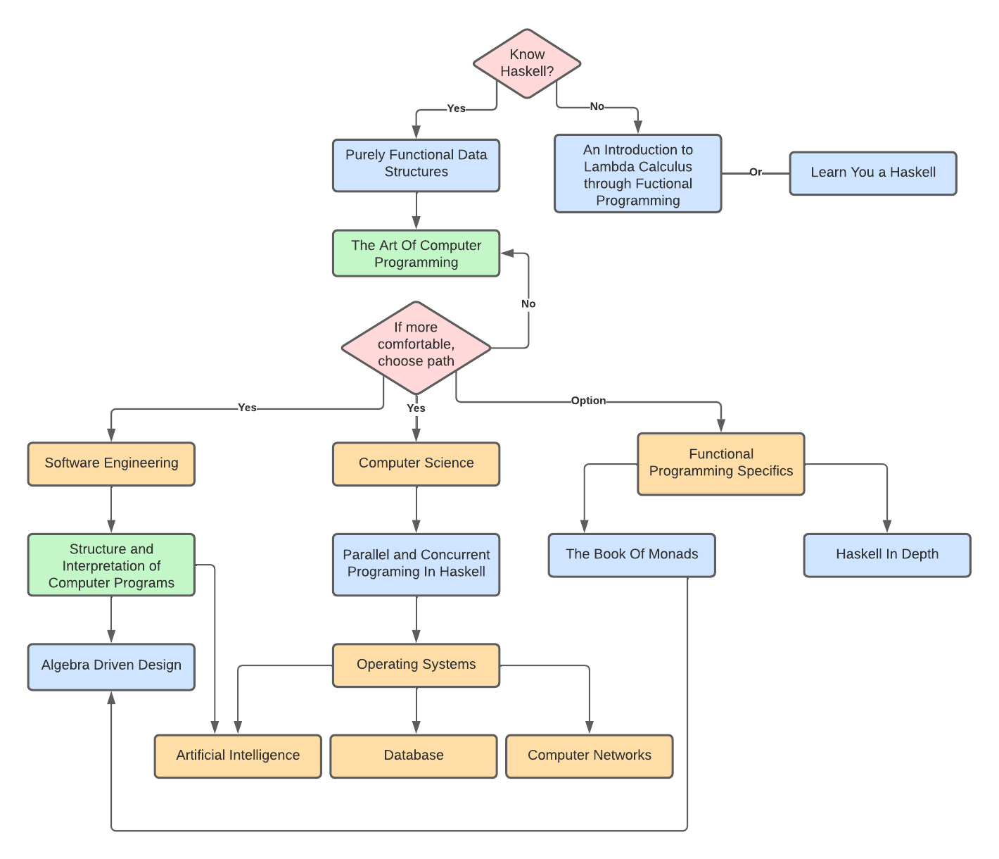

# Haskell Mastery
This is a repository containing:
1. computer science topics (from basics to
advanced), like [data structures](./comp_science/ds/), [algorithms](./comp_science/algo)1, etc.

2. software engineering practices like [Algebra-Driven
Design](./advance/software_eng/add), [programming structure](./advance/software_eng/sicp) 

3. functional programming (and Haskell) specifics like [monads](./fp_specific/monads) 

***All implemented in Haskell***.

1 It is likely to find programming exercises here also from [Project
Euler](https://projecteuler.net)

# Path
Legend:
- *Books*
- *Highly Recommended Books*
- *Topics*
- *Decisions*

# Goal
The goal of this repository is learn Haskell by applying all topics covered
here in order to develop better practices before implementing for the Real
World. Here is a quote from Esdger Dijkstra that inspired me to do so:
> Programming is one of the most difficult branches of applied mathematics; the
> poorer mathematicians had better remain pure mathematicians.

# Resources
1. *Purely Functional Data Structures* by Chris Okasaki
2. *The Art Of Computer Programming Vol. 1* by Donald Knuth
3. *The Art Of Computer Programming Vol. 2* by Donald Knuth
4. *Cracking the Coding Interview*
5. *Algebra-Driven Design* by Sandy Maguire
6. *Structure and Interpretation of Computer Programs* by Gerald Sussman
7. [Project Euler](https://projecteuler.net)
