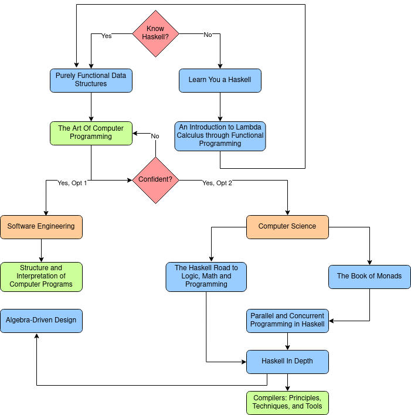

# Haskell Mastery
This is a repository containing:
1. intro: data structures, algorithms, functional programming specific (SICP,
   Purely Functional Data Structures, Introduction to Functional Programming
   through the Lambda Calculus)

2. advanced: programming languages, compilers, interpreters 

3. master: Software Engineering

# Path
Legend:
- blue: Books
- green: Highly Recommended Books
- orange: Topics
- red: Decisions

# Goal
The goal of this repository is learn Haskell by applying all topics covered
here in order to develop better practices before implementing for the Real
World. Here is a quote from Esdger Dijkstra that inspired me to do so:
> Programming is one of the most difficult branches of applied mathematics; the
> poorer mathematicians had better remain pure mathematicians.

# Resources
1. *Purely Functional Data Structures* by Chris Okasaki
2. *Structure and Interpretation of Computer Programs* by Gerald Sussman
3. *Introduction to Functional Programming through the Lambda Calculus*
4. *Crafting Intrepreters* by 
5. *Compilers: Principles, Techniques, and Tools*  
6. *The Art Of Computer Programming Vol. 1* by Donald Knuth
7. *The Art Of Computer Programming Vol. 2* by Donald Knuth
8. *The Art Of Computer Programming Vol. 3* by Donald Knuth
9. *Algebra-Driven Design* by Sandy Maguire
